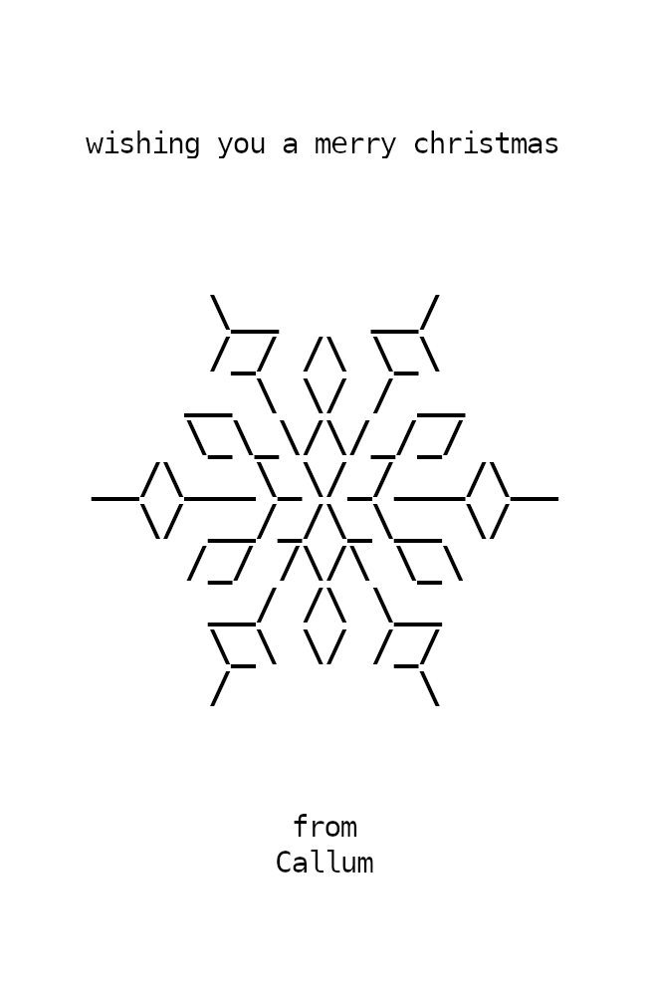
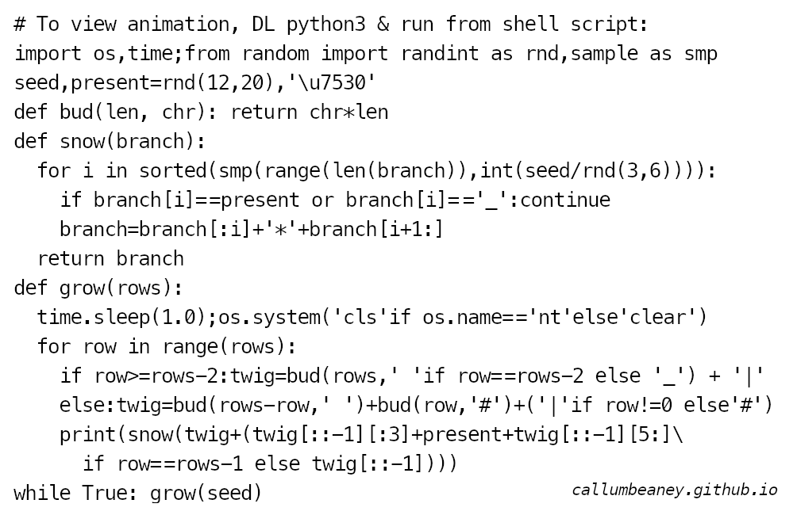

I wanted a little Christmas ASCII animation script to give to folks for a bit of fun for Winter 2024 that:
- looks slightly obfuscated but gives an idea of how it works at a glance  
- is terse enough to fit on the back of a business card (55x85mm)
- is after core dependencies platform-agnostic (so no terminal colours)
     
 

  
